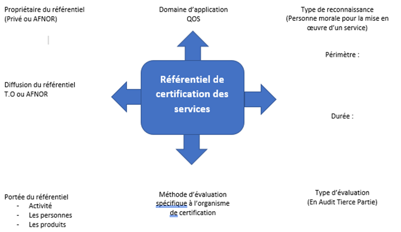

*17/12/18*

Cours avec Mr Seimann

# Audit Sécurité et Réseau

L'audit est binaire : il est conforme ou non conforme. Il se fait à partir d'outils.

La reconnaissance est représentée généralement sous la forme d'un certificat de conformité, un diplôme ou un prix. Elle peut être binaire et/ou exclusive. Elle peut être obtenue par une représentation par point aussi liée à un référentiel.

L'attestation est une représentation plus générale plus la forme d'un certificat : on atteste qu'on a assisté au cours, pas qu'on en a intégré les connaissances. 

Et pour bien commencer la semaine, un schéma de tonton Seimann :

<u>Cycle de validation</u>

La certification de services permet d'avoir une qualité de service dans un référentiel donné. C'est aussi un complément par rapport l'iso 9000, qui permet de renforcer telle ou telle partie de l'audit. La recherche d'une valorisation de service est un gage de qualité, ça permet d'améliorer l'image de l'entreprise, d'avoir une image innovante, de se différencier par rapport aux concurrents. Démarche très française.

<u>Référentiel de certification des services</u> 

Information Système Audit et Association

Cobit est apparu en 1974. Il propose :

- Un référentiel unique pour effectuer les contrôles internes.
- Un outil externe qui permet de gérer les interactions avec la DSI.
- Un cadre d'investigation pour les auditeurs externes (permet d'effectuer les analyses pour ls actionnaires, les commissaires aux comptes, peut avoir une valeur juridique)
- Permet de couvrir la gouvernance d'un SI et de mettre en œuvre la gouvernance des risques. Peut intrégrer d’autres référentiels (ITIL, CMMI, ISO 27 000)
- Aide les dirigeants à contrôler les risques 

Il a un canva très fourni, a un sacré référentiel, très minutieux.

Comment ça doit se passer :

- Processus d'audit des systèmes d'information
- Gestion (des budgets, des dépenses...)
- Planification et organisation des systèmes d'information
- Infra technique 
- Protection des avoirs informatiques
- Plan de secours et de reprise d'activité
- cycle de vie des systèmes d'application commerciaux
- évaluation des process métier de gestion des risques
- gestion des incidents

COBIT c'est la plus grosse certification concernant l'audit. Pour une société de jsépakoi

### e-SCM

Cela inclus les machins d'infogérence, d'achat, de finance et des trucs.

Y a deux trucs, y a un truc pour header et le ccl qui veut dire client et service. Les entreprises qui ont participé à cette certif sont IGS, EDS (racheté par HP), HP, accenture, deux lois qui se touchent, computer associate, carmet gimulon university. Cobit et CMMI. 

### iso 27000

fait suite à norme iso 177 - 99 et est complémentaire et est accompagnée d'autres normes. d'énormes norme normales. La 27 002 remplace la 177 99 y a eu la 27 001, 2, 3...

Une pour chaque mais y parle trop vite pour noter. 5 pour gestion risques

Adopte une démarche de PDCA et utilise EBIOS pour faire les audits. On met en place un système de sécurité inform ou on met ensuite en place un SMSI. D'abord choix du périmètre. Et on détermine dans ce périmètre éléments de confiance. Une entreprise peut être certif 27001 sur un périmètre très réduit ou une politique très peu exigeante. On va apprécier les risques. On va faire l'identification des actifs, personnes responsables, vulnérabilités (ex: portables), menaces, impact. On met une note pour tous les actifs, on évalue vraisemblance, estime niveaux de risque (tests intrusion, fiabilité syst), traitement des risques

### IT SEC

Lié à un un logiciel ou un système. Évalué par une tierce partie t direction centrale de sécurité des SI. Propriétaire du référentiel : UE. Écrite en 1991. S'inspire d'une initiative américaine et permet de définir le degré de sécurité d'un produit. L'évaluation porte sur deux aspects complémentaires : conformité et efficacité. Trois niveaux de confiance : élémentaire, moyen, élevé. 

