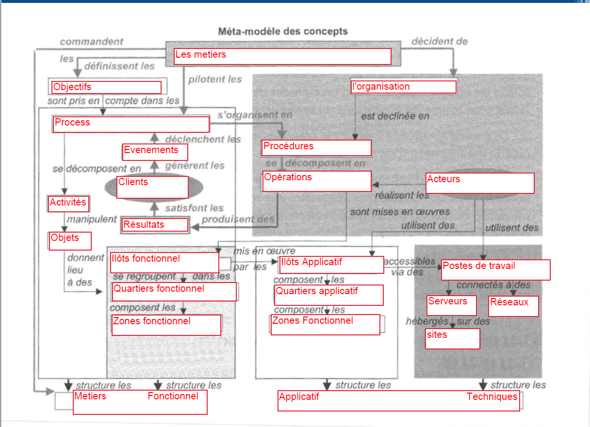

# Introduction

## Qu'est-ce que l'urbanisation des SI ?

Urbanisation : amélioration/optimisation/agencement d'un système pour ses membres.

BPM = Business Process Management.  
C'est un concept qu'on retrouve dans l'urbanisation des SI, qui touche à la transformation digitale. C'est l'urbanisation, pour les petites entreprises. On reviendra souvent dessus dans le cours  
BPMN : système de notation du BPM.

Pour le gérer un SI (max couverture, max taux de couv), il faut faire du management des SI.   
À l'intérieur du management on a la gouvernance des SI, pour en contrôler et piloter l'évolution (ITIL, COBIT...)  
Mais pour pouvoir le contrôler il faut mettre en place des bonnes pratiques. C'est là qu'arrive le sous-domaine **urbanisation des SI**. Elle est toujours centrée métier donc centrée process, donc c'est un BPM.  
Elle permet d'apporter plus d'information pour la gouvernance. 

Max couverture : besoin fonctionnel  
Max DI : Taux de couverture = chaque besoin fonctionnel de l'entreprise doit être couvert.

L'idée de l'urba est d'utiliser la métaphore avec l'urbanisation des villes pour l'appliquer au SI, car on a une complexité similaire entre un SI et une ville.

En urba, 2 mots clefs : **cohérence** et **agilité**.  
Le but est de rendre le SI **cohérent** par rapport à la stratégie de l'entreprise.  Il faut aussi le rendre **agile** par rapport au besoin du marché

## Plan

- L'urbanisation des SI
  - Architecture d'entreprise
  - Notion d'urbanisation
  - Métamodèle de concepts
- Le processus d'urbanisation
- Le management des processus

## Partiel

- Étude de cas
- TD

# I - L'urbanisation des SI

## Contexte stratégique

Les contextes sont les occasions de regarder nos process métiers et de les reprendre.

3 phénomènes font pression sur le besoin d'urbanisation du SI. Également d'autres éléments de contexte poussent vers l'urbanisation. (p4pdf)  
La montée des nouvelles technologies peut rendre un système obsolète en 3 ans. >> Il faut faire une veille fournie et constante.

Le contexte dans les entreprises, c'est plusieurs besoins (p5pdf) :

- besoin d'adapter la stratégie pour que l'entreprise devienne meilleure.
- pour ça il faut analyser les processus, la chaine (voir BPM). KPM = clé d'indications de performances. C'est le process qui fait ça.
- process étendu = qui touche plusieurs flux/logiciels. Qui part du fournisseur et qui va jusqu'au client. Ex : la chaine logistique. C'est souvent complexe à gérer, il faut donc des process bien optimisé, un plan d'action (BPM).

Contexte stratégique : on retrouve dans l'entreprise une demande croissante d'évolution. S'ajoute à ça le gros bordel de l'entreprise : des versions différentes, des langages diférents, logiciels différents. Ça rend le système rigide, l'acquis est lourd. On peut pas tout changer en partant du principe que c'est pourri, il faut tenir compte de l'ancienneté de la boite et effectuer une évolution, pas une révolution. Faire une refonte complète a trop de désavantages : cher, risqué, manque de valeur ajoutée. 

L'objectif est d'améliorer l'adaptabilité du SI et de son parc applicatif. On ne réagit pas directement face à un besoin, mais on évolue de façon permanente. On est dans le progessif. Simplification maximum de l'architecture, optimisation de la valeur ajouté, rendre le SI plus flexible.

Dans ce contexte stratégique on retrouve les mots clefs :

- **évolutivité**
- **performance**
- **alignement stratégique**

## L'architecture d'entreprise - EA

Le lean management se retrouve imbriqué dans l'EA (lean management : voir cours de Marketing **numérique** (et pas digital parce que digital c'est les doigts, putain))

L'EA est un cadre commun qui permet la communication entre le comité pilotage et les exécuteurs et responsables métiers. C'est le seul moyen de communication qui permet ça. **C'est le socle de l'urba des SI**. Sans EA on arrive pas à mettre en place (d'un point de vue pratique) les lignes et objectifs de l'entreprise.

L'EA met les différentes visions de l'architecture en synergie avec archi métier (c'est ça l'alignement statégique)

### Comment établir l'EA ? 

On commence par établir l'architecture existante, puis on définit l'architecture cible. Pour faire l'existante, voir p11pdf

L'EA va établir une feuille de route, dans laquelle on retrouve entre autres (p12pdf) le schéma directeur informatique (consultable en ligne, chaque boite doit la publier tous les 3 ans. cf. celle de la caisse de retraite).

C'est donc un travail autour du SI, dans lequel on fait intervenir tous les acteurs (DSI, MOE, MOA, archi d'entreprise, urbaniste... p13pdf).

Il faut avoir un cadre de référence. Dedans on retrouve plusieurs visions (p14pdf)

### Cadre Zachman

Le premier c'est le cadre Zachman. il fonctionne avec des problématiques (p15pdf).  
Pour lui l'entreprise est modélisée comme un ensemble de briques. Il faut répondre à ces problématiques pour chaque brique. Il ne s'agit pas d'un référentiel (= comment faire) mais d'un cadre de référence (= que regarder). Dedans on a différentes visions sur l'entreprise (p16pdf). Ce n'est pas un référentiel il n'y a donc pas bcp de choses (p17pdf), c'est un ensemble de briques élémentaires qui vont définir l'entreprise et son outil. 

### Cadre TOGAF

Plusieurs références, éléments, à regarder. On passe rapidement dessus, c'est utile pour ceux qui veulent faire de la transformation digitale. TOGAF est, lui, un réferentiel. 

### De l'EA vers l'urbanisation

On part d'un truc vers un autre j'ai pas tout suivi.  
Urbanisation = vision centrée métier. On va mettre en place différents éléments (p24pdf)

## Notions d'urbanisme

### La métaphore de l'urbanisme.

On utilise des modèles de l'urbanisme pour adapter le SI. 

Ce qu'on peut assurer avec l'urbanistation du SI c'est :

- Gagner en souplesse et en réactivité
- Réussir l'ouverture du SI à de multiples et même nouveaux acteurs
- Assurer la capitalisation et la valorisation des acquis de l'expertise métier

### Définitions

p27pdf.  
Urbanisation = application d'un plan d'urbanisation sur le SI.

Comment fonctionne l'urbanisation ?  
On part d'une architecture non organisée, et on applique les règles d'urbanisation pour arriver à une architecture cible, qui sera, elle, organisée. 

La nouvelle architecture urbanisée participe au dispositif de gouvernance. Elle est évolutive, peut accueillir de nouveaux composants.

### Apports 

L'urbanisation est un apport dans gestion des risques parce qu'on peut les établir et les régler très rapidement grâce à elle.

### L'outil cartographique

Sans outil de cartographie, on peut rien faire. On a besoin de l'architecture actuelle et de l'architecture cible, c'est pour ça qu'on a besoin de l'outil de cartographie. Il faut établir 4 cartographies (p34pdf). 

p34pdf : liste des étapes du bon déroulement d'un plan d'urbanisation.

L'urbanisation des SI est la solution au RGPD  
Il y a différentes motivations à l'urbanisation des SI (p36pdf)

## Métamodèle

Il y a un métamodèle de l'urbanisation des SI. Il faut remplir les trous de Barhi avec les concepts de base de l'urbanisation des SI.
Le métamodèle est basé sur concepts de base de l'urbanisme : zones, quartiers, îlots... avec une notion de hiérarchie et d'appartenance.
Voir metamodele.png (Ressources)

Le métamodèle permet d'organiser la vue fonctionnelle et applicative de notre urbanisation. C'est un référentiel : un guide de bonnes pratiques. 

## TD 1

1. L'urbanisme est un cadre d'évolution des SI. Ce cadre là met en valeur les différentes actions à entreprendre pour améliorer les SI. Tandis que l'urbanisation est un cadre pratique de bonnes pratiques
2. Il y a 5 composantes : stratégique, métier, fonctionnelle, applicative et technique.  
   Le process d'urbanisation c'est passer d'une EA existante à une EA cible. Pour ça 4 vues : métier, fonctionnelle, applicative et technique
3. Il est impératif de cartographier les 4 vues du système. Également avoir une carto existante et une cible.
4. Modularité : permise par le découpage en briques. On a ainsi une architecture très modulaire pour permettre l'évolutivité (pour ça qu'on parle de quartiers, d'îlots de blocs).
   Subsidiarité : Car on découpe en zones, en quartiers, en îlots, en blocs. Il y a une hiérarchie forte entre des éléments. Ça permet d'être agile, réactif.
   Progressivité : car il s'agit d'une plateforme d'échange (ou collaborative, ou bus d'intégration entre les différents modules)

_16/10/18_

# II - Le processus d'urbanisation 

L'urbanisation des SI est en complément de la gouvernance des SI.

## Introduction au processus d'urbanisation

### Définition

Le processus d'urbanisation c'est l'ensemble des activités nécessaires pour obtenir un SI urbanisé. Il ne s'agit pas d'un processus figé : il est continu, on a un cercle de transformation. Au bout de 3 ans, le schéma directeur est remis à jour et remet à jour la cartographie des process >> C'est un processus permanent, pas limité dans le temps.

L'objectif est de simplifier et d'optimiser la valeur ajoutée du SI, de rendre le SI plus adaptable et flexible, de saisir les nouvelles opportunités technologiques pour mettre à jour le SI. Mais également de participer à la gouvernance des SI : une fois le SI performant, il faut le contrôler et le piloter. Le management permet de le rendre efficace, la gouvernance de le piloter.

### Processus & niveaux de préoccupation

Urba des SI : vision orientée process. On en a des microscopiques et des macroscopiques : plusieurs vues dans urba SI.

Trois niveaux principaux : 

- métier
- fonctionnel
- technologique

## Les sous-processus

### Le pilotage

Il s'agit d'un projet du SI. C'est donc complexe à gérer. Il faut donc en premier lieu penser au pilotage. Grâce à ça on réduit le pourcentage d'échec du projet. On va donc rapidement regarder quels process prioriser pour l'optimisation. 

### Les processus opérationnels

Qu'est-ce qui a de la valeur dans le SI ? Le service.  
Quand on veut optimiser, il faut aller directement sur les process qui ont de la valeur, donc les process opérationnels, donc les process métiers (p6pdf). 

Il faut un chef d'orchestre pour tout ça : c'est l'urbaniste. Il doit avoir une connaissance métier. Il doit être fonctionnel, technique, et avoir un peu de connaissances en business/stratégie >> vision urbanistique.  
Urbanisation évite les projets "d'urgence" : c'est anticipé avant qu'on arrive sur une archi obsolète. 

### Support et communicaiiton

La communication est importante, elle doit être présente auprès de tous les acteurs. établir et diffuser des documents et cartographies permet de diffuser les connaissances.

### Temporalité

Trois aspects à prendre en compte :

- Prospectif : C'est un process permanent, il va donc être prospectif par rapport à l'évolution du SI. Attention à la cohérence par rapport à la stratégie d'entreprise : il doit aussi être stable, modulaire, et se baser toujours sur les process métier de l'entreprise. 
- Cadastral : faire des cartographies par couche. On obtient des carte de reférence de l'actuel, de l'ancien et de ce qu'on veut faire.
- Opérationnel : impact, scenarii du projet, lien avec équipe opérationnelle. On est dans la réalité informatique.

## Les acteurs de l'urbanisation

### Acteurs

Dans un process d'urba des SI on retrouve :

- Urbanistes (ou architecte d'entreprise)
- Direction des SI
- Direction métier
- Responsable domaine fonctionnel
- Responsable projet (couche exécutive et fonctionnelle)

Mais aussi (plus en périphérie) : architecte technique, consultant BPR, expert en conduite du changement (pour les réfractaires au nouveau SI), expert métier (donnent les besoins).  
BPR =  Business Process Reengineering

Trois types de reenginering : 

- radical : on rase tout, on repart de 0. Coûte ultra cher
- opportuniste : profite des projets qui arrivent, est dans l'urgence
- progressiste : fonctionne par évolutions, le meilleur type.

### Instances

On vient de voir les ressources humaines, mais on va toucher aussi les départements de l'entreprise, on appelle ça des instances. Il ne s'agit plus d'un acteur mais d'une équipe, une unité organisationnelle (détail p11pdf).

### Compétences

Liste des compétences requises chez l'urbaniste : p12pdf

- pour l'analyse de risques : il doit être auditeur avant tout, car il doit analyser l'existant pour faire l'architecture cible.
- la connaissance stratégique est là car car c'est un architecte.
- la qualité rédactionnelle est notamment en anglais si le projet est à portée internationale

L'urbaniste est donc une perle rare.

## L'indice d'urbanisation

### Introduction

C'est l'établissement de l'état de l'urba du SI actuellement, pour tout ou partie de l'organisation'. 

Il définit et suit les actions menées, c'est un outil de gouvernance. 

### Axes d'analyse

Ce sont les axes qu'on retrouve dans le référentiel TOGAF. 

1. Connaître les SI existant et cible
2. Pour ensuite gérer les référentiels d'entreprise
3. Voir les cartographies de l'entreprise
4. Accompagner les projets
5. Maîtriser la complexité des flux d'échange (cartographie des process)
6. Piloter l'urba des SI
7. Faire la communication sur l'urba et développer les compétences

Pour chaque axe, il faut donner critère entre 2 et 8, et noter chaque criète entre 0 et 4. On obtient une grille prédifinie et on se base sur un radar. 

Il y a un lien étroit entre indice et process : les processus sont les critères des indices qui sont notés

## Influence de l'organisation sur les projets SI

### Les projets dans le processus

p17pdf : 3 composantes principales, et les autres.

Pour pouvoir gérer ces 3 composantes, l'urba doit être impliqué et communiquant. 

### Apport de l'urbanisation aux projets

Oouruqoi on fait de l'urba ? Le process permet plusieurs apports en externe de la modernisation du SI. 

- Surtout dans le dev applicatif. Car la couche applicative est impacté par l'urba
- Aussi dans le choix du logiciel, il y a souvent derrière un progiciel, un ERP qui va évoluer
- Également la maintenance va être améliorée
- Enfin l'architecture va être plus modulaire et dépoussiérée

Les avantages :

- limiter les projets redondants
- simplifier les intégrations en limitant les impacts : pour cela la meilleure solution = les microservices.
- maitrise le périmètre de projet : pas d'effet tunnel. 
- garantir la cohérence, l'evolutivité, la flexibilité applicative et technique : on est sur la même techno de langages (par exemple)...
- arbitrer les choix progiciels vs développement spécifique : sélectionner la meilleure solution pour les projets
- prioriser les projets

On limite donc coutrs liés aux projet, on maitris ele sporjets

### Coûts de l'urbanisme

Les coûts prennent en compte tous les efforts qui vont être faits pour mettre en place le projet. Il faut voir également le retour sur investissement que l'on va faire. Les tâche pour "après" (liés à l'évolutivité) ne sont pas chiffrables, mais doivent être quand même prises en compte.

## Le rôle de l'urbaniste

4 rôles :

- formation
- conseil
- validation
- contrôle

Les risques sont d'être trop impliqué ou trop peu communiquant et pas assez dans le projet. L'urbaniste doit trouver le positionnement correct entre trop d'implication et pas assez.

## Les règles d'urbanisme

### Définition

Les rèlges permettent de formuler ce qui est interdit et exigé. 

Elles doivent être définies dès le départ, validée, acceptées, controlées, notamment par la par direction.

### Typologie des règles

On en trouve pour les phases en amont du projet et pour les phases de la suite. Ces règles sont parfois assimilées à des bonnes pratiques

Ce qu'on va y faire p23pdf

## L'urbanisme VS COBIT/ITIL

Pourquoi ajouter des règles d'urba à COBIT et ITIL ? 

### COBIT

On retrouve l'urbanisme dans PO et AI de COBIT. Donc l'urba participe à ces deux domaines du référentiel de COBIT. 

On a donc des liens entre les composants des process de ces deux approches : ils ne sont pas en conflit. 

### ITIL

C'est une couche service, pas process. Il n'y a donc pas de lien direct avec l'urba. Mais lorsqu'on utilise ITIL, on va avoir besoin d'indices de process, qui sont des indicateurs de l'urbanisme. Il exite donc un lien indirect : l'urba donne les moyens pour optimiser les services d'ITIL. L'urba peut ainsi servir de support à ITIL.

## Synthèse

D'abord hercher les acteurs

3 composantes dans les process:  pilotage, étude en amont, spliter/prioriser les projets

Pour ça, de l'aide : grace à support, référentiels (données/service), proposer l'architecture

---

*27/11/18*

On a vu le concept, aujourd'hui on passe au concret. Comment mettre à plat les process.

DL de Bonita soft.

# III - Le management des processus : BPM

## Les processus

### Définition

Un process, c'est un ensemble d'activités en interaction qui transforment des éléments d'entrée en éléments de sortie.

Chaque process doit avoir un résultat concret (envoyer une commande, satisfaire le client, produire un produit de qualité *q*) qu'on doit pouvoir quantifier. 

Il possède des acteurs internes comme externes. Également des ressources (serveur, équipe...)

Les 5 notions : objectif, ensemble d'activité, rôle, ressources, évènement (dans le cours y a marqué 6, le mystère de la dernière notion reste entier...)

3 types de process :

- opérationnel, ou métier : le résultat est un produit ou service
- support : le résultat est un moyen ou ressource (ex RH)
- qualité/pilotage

### Concepts

L'activité est composée d'un flux entrant et d'un flux sortant qui est le **résultat** : un évènement, une ressource qui servira pour une autre activité. Entre les deux on a des actions et parfois des résultats intermédiaires.

Les autres concepts importants sont les acteurs, les ressources, les évènements (voir cours)

L'évènement déclenche une activité. Il y en a trois types : 

- délcencheur d'activité
- les interrupteurs qui font sortir de l'activité
- modifications qui influent sur déroulement de l'activité

Lorsqu'on organise un process, on modélise de façon organisée, on parle de structure de process. C'est la numérisation des process afin d'obtenir un résultat optimisé.

### Structuration

Il existe 3 approches. La première est la plus répandue à genre 80%

1. Mécaniste. Genre de procédural : enchainement d'activités dans un ordre établi. On regarde en prodondeur et en découpant toues les parties du process
2. Systémique. On s'intéresse uniquement à un système et on regarde uniquement son orchestration, ses liens entre les activités. On regarde le process comme une boite noire et on regarde ses liens avec les autres services, process. 
3. Émergente. Pas de lien préétabli entre les activités. On regard uniquement un process

Voir schéma sur PDF. 

## Le BPM

### Définition

C'est le management des processus

Ça permet d'optimiser les process métier existant en faisant collaborer tous les acteurs de la boite.

Ça permet notamment de masquer la complexité existante du SI. 

Pour cela, on commence par analyser et modéliser tous les processus. On regarde si ce qui existe est déjà optimisé ou non. 

### Cycle BPM

Ensemble des méthodes et d'outils qui permettent de étudier, modéliser, implémenter, piloter, exécuter, optimiser processus

Le schéma sur le PDF montre le flux, le contenu des rectangles est dans les pages suivant le schéma, dans le bon ordre.

### BAM

Business Activity Monitoring

### Bonnes pratiques

- Identifier le projet pilote et vérifier si y a un fort ROI. 
- Conduite du changement ! Avec une communication maximale pour éviter la résistance au changement et impliquer les gens. 

### Erreurs à éviter

Beaucoup de projets tombent à l'eau car personne ne sait qui est MOE et MOA. La définition de ces rôles est importante.

### Modélisation

Chaque process BPMN doit avoir un évènement de début et de fin.

## Notation BPMN 2.0

Voir pdf

On peut faire des sous-process indépendants réutilisables sinon ils sont intégrés (liés à une activité)

### Évenements

Un évènement c'est quelque chose qui arrive qui va déclencher tout le process. Ils sont représentés en cercle. Le type de bordure détermine le type d'évènement. 

